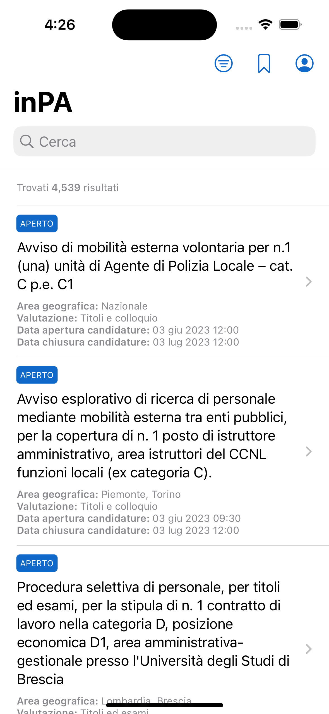
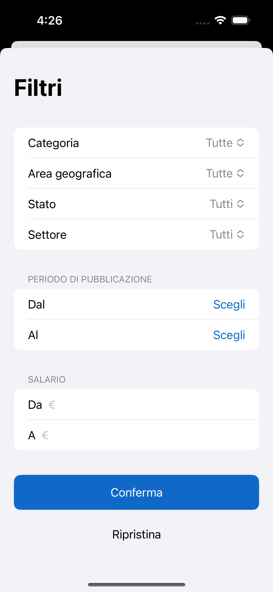

# inPA

App non ufficiale del portale [inPA](https://www.inpa.gov.it).

Con quest'app puoi:
- Visualizzare tutti i bandi/avvisi pubblicati e consultarne i dettagli
- Cercare un bando/avviso in particolare (tramite ricerca testuale o con i filtri a disposizione)
- Salvare un bando/avviso per dopo così da poterci accedere più velocemente
- Scaricare eventuali allegati presenti
- Inviare la tua candidatura tramite il portale web
- Accedere al tuo account tramite [SPID](https://www.spid.gov.it)
- Visualizzare le tue candidature (in fase di sviluppo)

## Screenshot

### iOS

| Home | Filtri |
| :-: | :-: |
|  |  |

---

&copy; 2023 - Alex Sandri
